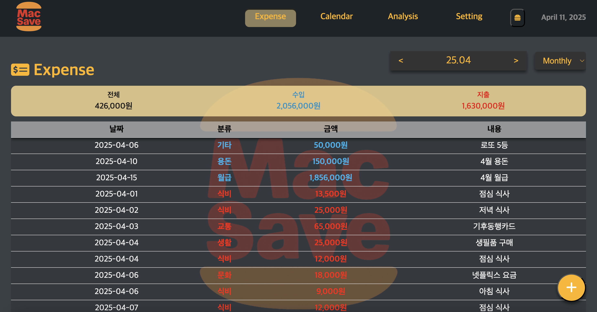
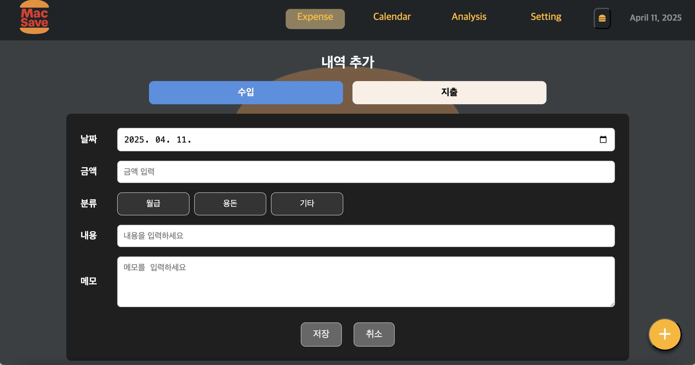
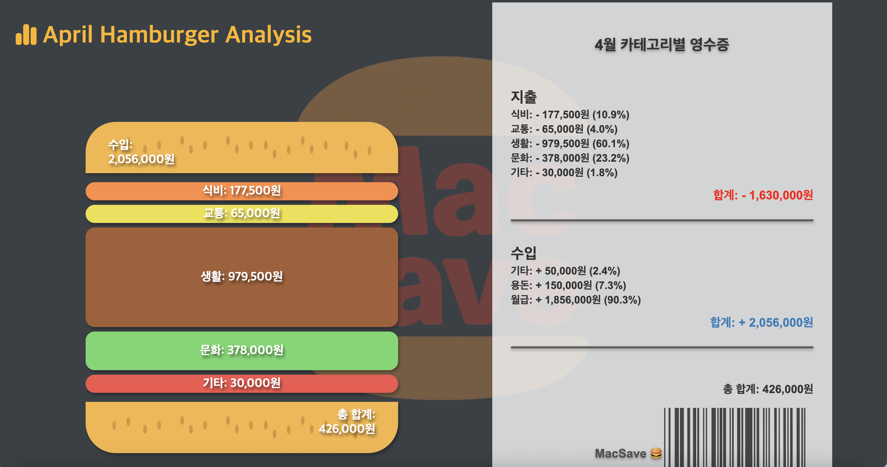
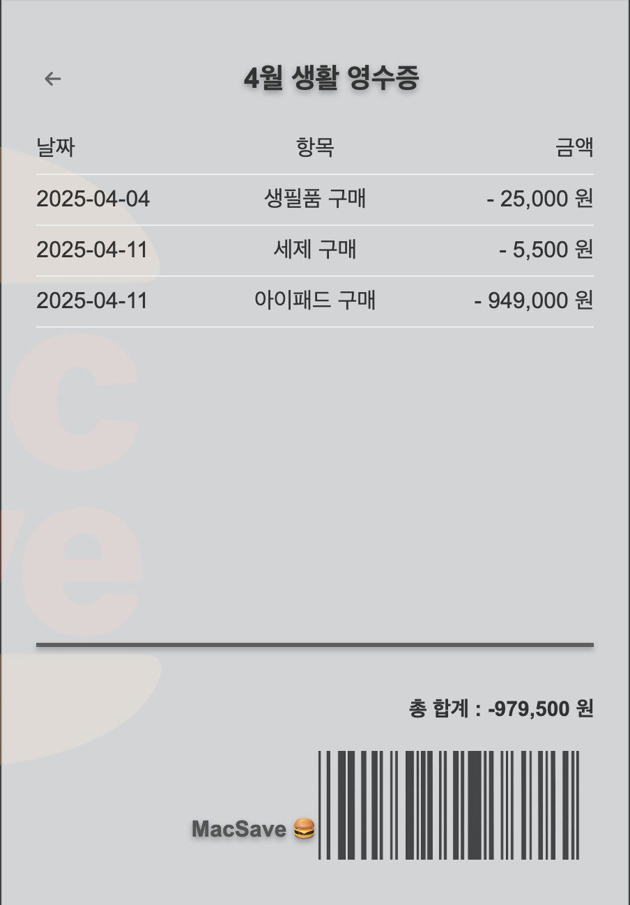
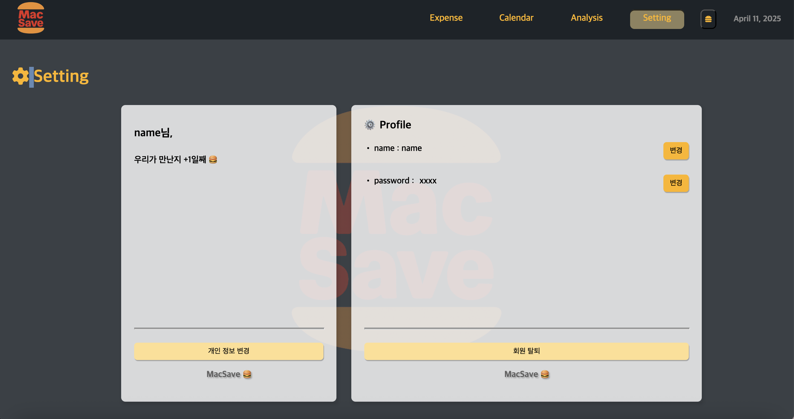
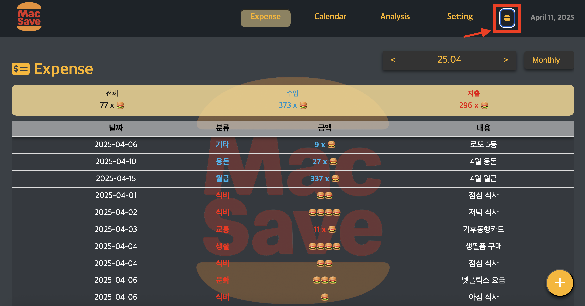

# 🍔 MacSave 가계부 프로젝트 

Vue.js와 json-server를 활용한 간단한 가계부 프로젝트입니다.
수입/지출을 입력하고, 카테고리별로 데이터를 필터링하며, 데이터를 손쉽게 수정 및 삭제할 수 있습니다.
햄버거 그래프를 활용하여 월 소비 내역을 직관적으로 쉽게 파악할 수 있습니다. 

---
이 저장소를 클론한 후 아래의 순서대로 실행하면 바로 가계부를 시작할 수 있습니다.

## 🚀 프로젝트 실행 방법

### 1. 저장소 클론

```bash
git clone 'https://github.com/sebin219/MacSave.git'
```

### 2. 의존성 설치

```
npm install
```

### 3. 개발 서버 실행

```
npm run dev
```

### 4. JSON DB 서버 실행

```
npm run db
```

### 5. 기타 설정

- **JSON DB 서버 주소**: [`http://localhost:5001`](http://localhost:5001)
- **개발 서버 주소 (Vite 기본값)**: [`http://localhost:5173`](http://localhost:5173)

---

## ⚙️ MacSave 가계부 주요 기능

- ✅ 수입/지출 추가 및 실시간 반영
- ✏️ 거래 내역 수정 모달
- ❌ 삭제 기능과 삭제 후 즉시 반영
- 📅 날짜별 필터링 
- 💬 메모 기능
- 📊 총합 계산
- 🗓️ 캘린더를 활용한 소비/지출 내역 파악
- 🍔 햄버거 그래프를 통한 나의 소비내역 분석
- 🍔 빅맥버튼 : 화폐단위를 원단위에서 빅맥단위로 변경하여 출력 (1🍔 = 5,500 원 )
- 🔄 json-server 연동 (REST API)

---

## 🛠️ 기술 스택

| 분야         | 사용 기술                |
|--------------|---------------------------|
| Frontend     | Vue 3, Composition API     |
| 상태 관리     | Pinia (수입/지출 각각 관리) |
| Backend (Mock) | json-server (`db.json`)   |
| HTTP 통신    | Axios                      |
| 기타         | Vite, ESLint, Prettier     |

---

## 🗂️ 프로젝트 구조

```bash
src/
├── components/
│   └── HeaderContainer.vue
├── layouts/
│   ├── DeafultLayout.vue
│   └── NoLayout.vue
├── router/
│   └── ...
├── stores/
│   ├── incomeStore.js
│   ├── expenseStore.js
│   └── ...
├── utils/
│   └── axios.js
├── pages/
│   ├── calendar/
│   │    └── ...
│   ├── history/
│   │    └── ...
│   ├── lock/
│   │    └── ...
│   ├── settings/
│   │    └── ...
│   └── stats/
│        └── ...
├── App.vue
└── main.js
```

---

## 🍔 MacSave 가계부 구성

### 1. 초기화면


MacSave 가계부의 초기화면입니다.
비밀번호를 설정하고 입력하면 가계부화면으로 넘어갑니다.
비밀번호 및 유저이름 정보는 db.json 에 저장됩니다.


### 2. Expense (소비/지출 내역)



MacSave 가계부의 소비/지출 내역입니다.
db.json에 저장된 내용을 불러와 지출/소비 내역을 출력합니다.

<div align="center">
  
  <p>내역 영수증</p>
</div>

+ 주요기능
  +  필터기능을 활용하여 주/월/연별로 조회가 가능합니다.
  +  `+` 버튼을 클릭하여 실시간으로 소비/지출 내역 추가가 가능합니다.
  +  내역 클릭시 상세내역 영수증을 확인 할 수 있습니다.
  +  상세내역 영수증에서 삭제/수정 버튼을 통해 내역 삭제/수정 가능합니다.

### 3. Calendar (달력형식 내역)


MacSave 가계부의 달력형식 내역입니다.
캘린더형식의 디자인을 통해 요약된 일별 소비/지출 내역을 확인 가능합니다.

### 4. Analysis (월별 통계 햄버거 그래프)



햄버거형태의 소비내역 요약 그래프입니다.
카테고리별 소비금액을 바탕으로 카테고리별 패티의 크기가 변경됩니다.
카테고리에 해당하는 패티를 클릭시 해당 카테고리 항목에 해당되는 상세 영수증이 출력됩니다.
<div align="center">
  
  <p>카테고리 별 내역 영수증</p>
</div>

### 5. Setting (설정)

사용자 정보를 제공 및 변경 가능한 설정기능을 제공합니다.
사용자의 이름 및 사용일수를 표시하며 , 개인 정보 변경 버튼 클릭 시 사용자의 name , password 를 변경가능합니다. 회원 탈퇴 클릭시 사용자의 정보가 초기화되며 초기화면으로 이동합니다.


### `추가 기능 : 🍔 빅맥 버튼` 



빅맥 버튼 클릭시 가계부의 화폐단위가 원 단위에서 빅맥가격 단위로 변경됩니다. 
🍔 단위는 실제 판매하는 빅맥 가격 단위에 맞춰 5,500원으로 설정되어 있으며 , 금액이 빅맥 단위에 맞춰 빅맥의 개수로 변환되어 출력됩니다 .

#### 출력 형태 : 
```
5개 이하의 🍔 단위: 일렬로 출력  
(ex. 22,000원 = 4 X 5,500(빅맥단위) = 🍔🍔🍔🍔)  

5개 초과의 🍔 단위: N x 🍔로 출력  
(ex. 222,000원 = 40 X 5,500(빅맥단위) = 40 X 🍔)
```


---
## 🎓 팀원 소개 및 역할

## Team MacSave (a.k.a GrayHamburger) 


### **임세빈 (팀장)** 
**GitHub ID** : [`sebin219`](https://github.com/sebin219)
  
 - 🗓️ **FullCalendar를 활용한 달력 표시**   
 - 📅 **일일 수입/지출 요약 표시**  
 - 🗃️ **월간 요약 카드 구현**  
#####
 

#### 김민지 (팀원)  
**GitHub ID** : [`minji677`](https://github.com/minji677)  

- 🎨 **Header 컴포넌트 구현**  
- ⚙️ **Setting 기능 구현**  
- 🔒 **개인 정보 관리 기능**  
  - 회원 탈퇴  
  - 정보 수정  
  - 이름 변경  

##### 
#### 김병로 (팀원) 

**GitHub ID** : [`limeflav0r`](https://github.com/limeflav0r)

- 📂 **내역 불러오기**  
- 🔍 **날짜별 내역 필터링**  
- ✏️ **실시간 내역 추가 및 수정**  

##### 
#### 김서현 (팀원) 
**GitHub ID** : [`westh07`](https://github.com/westh07)

- 🔑 **초기화면 구현**
  - 비밀번호 설정 및 입력
  - 로그인 상태 전환

- 🍔 **빅맥버튼 구현**
  - 버튼 클릭시 금액 단위 전환  


##### 
#### 박지훈 (팀원) 
**GitHub ID** : [`park-Jihun679`](https://github.com/park-Jihun679)
- 🍔 **햄버거 통계 그래프 구현**
  - 금액에 비례한 패티크기 반영
  - 해당 항목 패티 클릭시 항목 영수증으로 이동
- 🧾 **카테고리별 상세 영수증 구현**
##### 

---


## 개선사항

- **중복 코드에 대한 관리 개선 (코드 효율화)**
- **스타일 통일 및 세부 스타일 개선**
